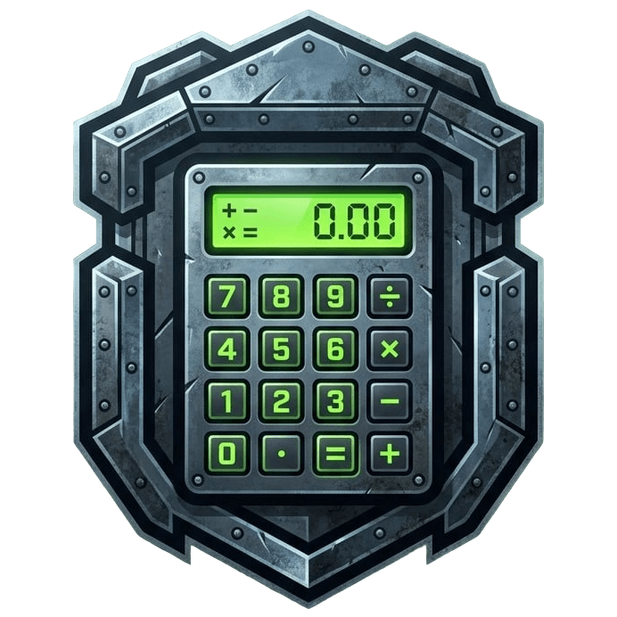

<h1 align="center"><u>Hideout Calculator</u></h1>

<div align="center">
  
</div>
<h3 align="center"> Hideout Calculator for Stalcraft:X </h3>

<p align="center">
    
    
<br>
    
    
</p>

> ⚠️ **DISCLAIMER**: This project is built with **vibecoding** - code quality, architecture, and best practices may vary. Use at your own discretion. PRs and improvements are welcome!

---

## 🇬🇧 English

### [+] Description
Craft calculator and CRM for the hideout in Stalcraft:X. Allows you to view and edit the craft tree in EMI-like style, calculate component costs on the auction house, taking into account hideout upgrade level and skills, track purchases and sales, and monitor the auction.

### [+] Features
- Recipe tree visualization
- Recipe tree editing
- Optimal craft component price calculation
- Shopping list generation
- Local storage of auction prices
- Auction monitoring

### [*] TO-DO
- Admin panel
- Authorization system
- Hideout upgrade level and skill accounting
- Experience and skill level gain calculation from crafting
- Auction price display with charts and history
- CRM Feature

### [+] Requirements
- docker
- docker compose

⚠️ **Important:**  
The project requires access to the **Stalcraft API**.

You can obtain an API key using the official instructions:  
👉 https://eapi.stalcraft.net/registration.html

Once you have it — fill in the corresponding fields in `.env`.
 
### [+] Installation
- `cp .env.example .env`
- `vi .env`
- `docker compose build`
- `docker compose up -d`

### [+] Contacts
<a href="mailto:darkbroshow@gmail.com" target="_blank"></a>
<a href="https://t.me/DarkBroShow" target="_blank"></a>

---

## 🇷🇺 Русский

> ⚠️ **ДИСКЛЕЙМЕР**: Этот проект сделан в стиле **вайбкод** — качество кода, архитектура и best practices могут быть далеки от идеала. Используйте на свой страх и риск. PR и улучшения приветствуются!

### [+] Описание
Калькулятор крафтов и CRM для убежища в Stalcraft:X. Позволяет просматривать и редактировать дерево крафтов в EMI-like стиле, подсчитывать стоимость компонентов на аукционе, учитывая уровень апгрейда убежища и навыков, вести учет закупок и продаж, мониторинг аукциона.

### [+] Возможности
- Построение дерева рецептов
- Редактирование дерева рецептов
- Подсчёт оптимальных цен компонентов крафта
- Вывод списка покупок
- Локальное хранение цен аукциона
- Мониторинг аукциона

### [*] В планах
- Админ-панель
- Система авторизации
- Учет уровня апгрейда убежища и навыков
- Подсчёт опыта и прокачки навыка в результате крафта
- Отображение цен аукциона с графиками и историей
- CRM система

### [+] Требования
- docker
- docker compose

⚠️ **Важно:**  
Для работы проекта требуется доступ к **Stalcraft API**.

Получить API-ключ можно по официальной инструкции:  
👉 https://eapi.stalcraft.net/registration.html

После получения — заполните соответствующие поля в `.env`.

### [+] Установка
- `cp .env.example .env`
- `vi .env`
- `docker compose build`
- `docker compose up -d`

### [+] Контакты
<a href="mailto:darkbroshow@gmail.com" target="_blank"></a>
<a href="https://t.me/DarkBroShow" target="_blank"></a>

---
### DEVELOPMENT INFO

## 🛠 Tech Stack

- **Frontend:** Vue/JS  
- **Backend:** FastAPI/Uvicorn  
- **Data:** JSON / PostgreSQL 
- **Dev:** Docker Compose  

## 📁 Project Structure

```text
frontend/   # client side
backend/    # server side
game-data/  # game data
scripts/    # utility scripts
docs/       # documentation
```

---

## 🔄 Git workflow

- 🌿 main branch for development until first release
- 🧩 New task = new branch
- 🔀 Merge into main only via Pull Request
- 📝 Commits follow Conventional Commits


---

## 🗺 Roadmap

- [✔] Full cost calculation
- [ ] Category filtering
- [ ] Craft comparison
- [ ] Authorization / user profiles
- [ ] Hideout level and skill tracking
- [ ] Auction history viewer

---

## 📌 Примечания

- Project is actively developed 🚧
- Game data is updated via an external repository
- Access to the official API is required for proper operation
---
