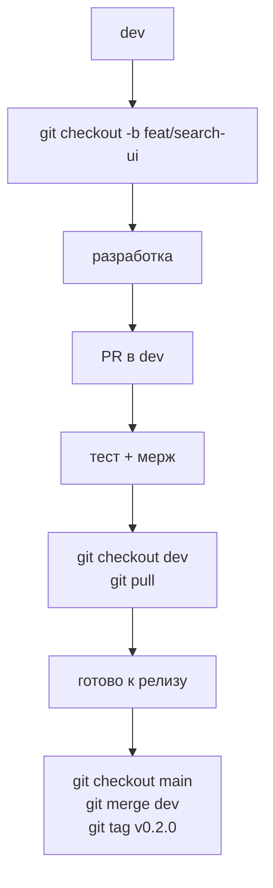

# GitFlow

## Ранний этап разработки

На самом раннем этапе (pre‑alpha):

- Вся активная разработка ведётся **напрямую в `main`**.
- Ветка `dev` временно не используется, `main` одновременно является и рабочей, и дев‑веткой.
- Допускается использование короткоживущих веток `feat/*` и `fix/*` с мержем обратно в `main`.

Когда проект дорастает до стадии **alpha**:

- Созданная от `main`ветка `dev` снова используется.
- `main` становится стабильной/релизной веткой.
- Текущая разработка переносится в `dev`.

Пример перехода к alpha:

```bash
git checkout main
git pull
git checkout -b dev
git push -u origin dev
```

---

## Ветки

| Ветка              | Назначение                                                    |
|--------------------|----------------------------------------------------------------|
| `main`             | Рабочая/релизная версия (до alpha — ещё и ветка разработки)   |
| `dev`              | Текущая разработка (активна начиная с alpha)                  |
| `feat/название`    | Новая фича                                                    |
| `fix/название`     | Багфикс                                                       |
| `hotfix/критичный` | Срочный фикс продакшена (ветка от `main`)                     |
| `release/vX.Y.Z`   | Подготовка релиза (финальные правки перед тегом)              |

---

## Процесс (alpha и дальше)



Кратко:

- Фичи/фиксы разрабатываются в ветках `feat/*` и `fix/*`, мержатся через PR в `dev`.
- Для крупных релизов можно завести `release/vX.Y.Z` от `dev` и вносить туда только финальные правки.
- После стабилизации изменения из `dev` (или `release/vX.Y.Z`) вливаются в `main`, ставится тег версии.

---

## Коммиты (Conventional Commits)

Базовый формат:

```text
<type>[: <scope>]: <message>
```

Примеры:

```text
feat: add material editor
fix: recipe tree infinite loop
docs: update architecture diagram
refactor: split search composable
chore: bump vueflow version
```

Рекомендуемые типы:

- `feat`: новая функциональность.
- `fix`: исправление ошибки.
- `docs`: изменения только в документации.
- `style`: правки стиля, форматирования, линтеров (без изменения логики).
- `refactor`: изменения внутренней структуры кода без изменения поведения.
- `perf`: улучшение производительности.
- `test`: добавление/обновление тестов.
- `build`: изменения в системе сборки, зависимостях, конфиге bundler’ов.
- `ci`: изменения в конфигурации CI/CD.
- `chore`: рутинные задачи, не влияющие на продуктовый код (обновление инструментов, housekeeping).
- `revert`: откат ранее сделанного коммита.

---

## Релиз

Классический релизный цикл (alpha и дальше):

```bash
# обновить dev
git checkout dev
git pull

# создать релизную ветку
git checkout -b release/v0.2.0

# финальные фиксы, версия, changelog и т.п.
# ... коммиты вида:
# chore: prepare release v0.2.0

# слить релиз в main
git checkout main
git pull
git merge --no-ff release/v0.2.0

# тег и публикация
git tag v0.2.0
git push origin main --tags

# опционально: влить релиз обратно в dev (если были изменения только в release)
git checkout dev
git merge --no-ff release/v0.2.0
git push origin dev
```

Упрощённый вариант для небольших релизов:

```bash
git checkout dev
git pull
git checkout main
git pull
git merge --no-ff dev
git tag v0.2.0
git push origin main --tags
```