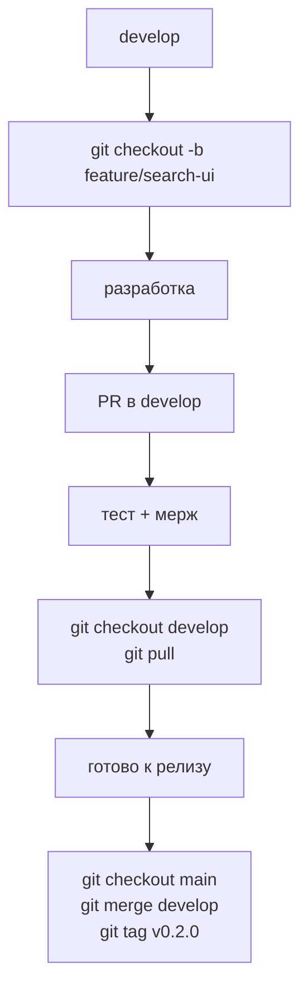

# GitFlow (упрощенный)

## Ветки
| Ветка | Назначение |
|-------|------------|
| `main` | Рабочая версия |
| `develop` | Текущая разработка |
| `feature/название` | Новая фича |
| `fix/название` | Багфикс |
| `hotfix/критичный` | Срочный фикс продакшена |

## Процесс


## Коммиты (Conventional Commits)
```
feat: add material editor
fix: recipe tree infinite loop
docs: update architecture diagram
refactor: split search composable
chore: bump vueflow version
```

## Релиз
```bash
git checkout develop
git checkout -b release/v0.2.0
# финальные фиксы
git checkout main
git merge release/v0.2.0
git tag v0.2.0
git push origin main --tags
```
